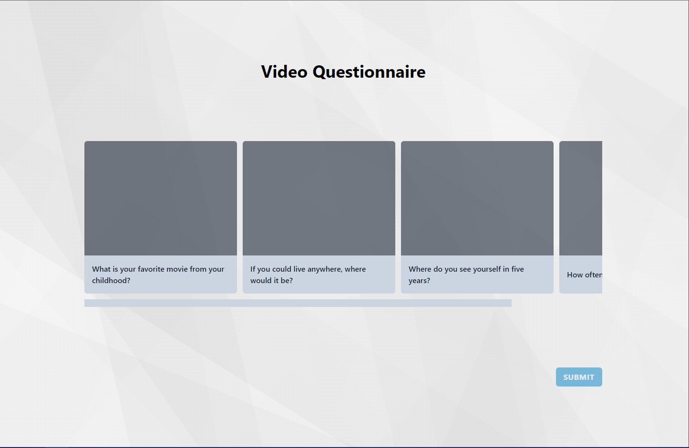
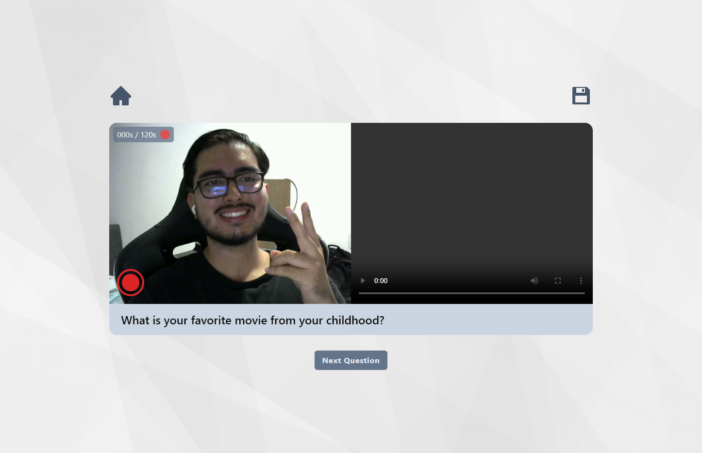

# **Challenge #2 for Krowdy Bootcamp**

The following repo contains my solution for the second challenge of the Web Development Bootcamp by [Krowdy Academy](https://www.krowdy.com/).

The challenge consists in creating a Video Questionnarie Web Application made with React. The main purpose was to understand the native WebRTC API and translate it to React code.

The following tools were used for the creation of this project:

It had to pass the following requirements:

- Different views
- Record WebCam and Video
- Re-recording
- Recording can be stopped
- Recording will stop after 2 minutes
- "Submit" button implemented only after all questions are answered
- Recordings can be played on the "list view"
- Customizable (Easily customizable, must allow more than 4 questions)

## **Evidences**

All of the previous requirements were satisfied. In following images you can see evidence on the work previously described:

### **1. Home View**

> It starts with the previously configured questions (more info in that later), if you click on a card, you'll be redirected to the respecting detail view. As the image shows, it has a horizontal scrollbar, so you can add as many questions as you want!
>
> _(The submit button is disabled as of now, when all the questions are answered, it will enable)_

### **2. Detail View**

> When you click on one of the Home View cards, it will open this view, breaking it down:
>
> - On the top left: Go back to Home View Button
> - On the top right: Save recorded video, if you haven't recorded a video, it will notify you.
> - Middle left: "Recording zone", here you'll see what your camera sees. On the top is the timer (having a maximum of 120 seconds, then the video will stop automatically, and on the bottom is the Start Recording / Stop Recording button)
> - Middle right: "Recorded zone", once you record a video, it will show on the right, where you can replay it
> - Bottom: Next question button, if there any unanswered questions, it will redirect you to the next unanswered question, if all of them are answered, it will redirect you to the Home View.

### **3. Small demo**

> In this demo you can see How the Detail View and the Home View interact between each other, and also how the video from the camera gets recorded and shared between different components.

### **4. Full demo**

> Here you can see almost all of the App flow, (realistically the idea will be to talk and answer the questions but GIFs can't capture audio so I made it short for the purposes of this demo).

## **Main challenges/obstacles**

- Well the first thing was understading WebRTC, all of its documentation was for VanillaJS, and it was kinda hard to translate it to React. At the end, refs saved me haha.
- Then, managing state, for this exercise I used zustand, which is a state-management library with very few boilerplate and is not as heavy as redux. Still I had like 3 versions of stores before defining the one that I ended up with.
- Understaing tailwind, In the past i've seen tailwind tutorials and really didn't get it as I've never used it, for this exercise I wanted to challenge myself to use it, and I loved it, it makes my coding way faster.
